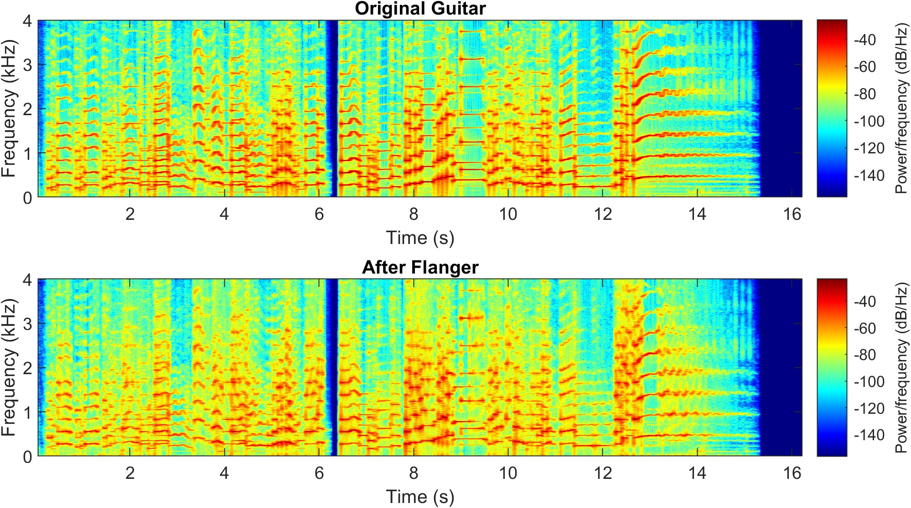
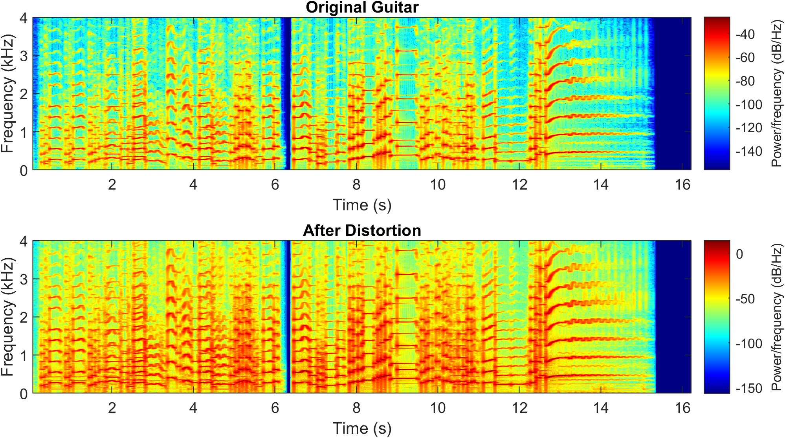

# 🎸 Digital Guitar Effects in MATLAB

This project demonstrates a set of digital guitar effects implemented in pure MATLAB.  
The code processes a clean guitar signal (from a solo by my band *Buluşalım Rüyalarda- Siyah Orkide*) and applies common effects such as:

- Delay
- Reverb
- Chorus / Octaver
- Flanger
- Phaser
- Distortion
- Low-Pass Filter
- High-Pass Filter
- Wah Pedal

Each effect is implemented from scratch using basic signal processing equations — no toolboxes, plugins, or external packages were used.

---

## 🧠 How It Works

All processing is done in a single script: [`Guitar_FX.m`](Guitar_FX.m)

Simply provide a mono `.wav` file (e.g., `guitar_clean.wav`) in the same directory and run the script in MATLAB.

Each effect block:
- Applies the DSP algorithm
- Outputs the result via `sound(...)`
- Generates plots and (optionally) spectrograms

---

## 🔍 Spectrogram Visualizations

Spectrograms showing the time–frequency behavior of each effect are included in `/spectrograms`.

  
  

---

## 📄 Report

A technical mini-report is available in the [`report.pdf`](report.pdf) file.  
It includes:
- DSP equations  
- Observations from each spectrogram  
- A summary of methods used

---

## ⚖️ License

This project is licensed under the MIT License — free to use, modify, and cite. Attribution appreciated!

© 2025 Andac Y. Kaya
