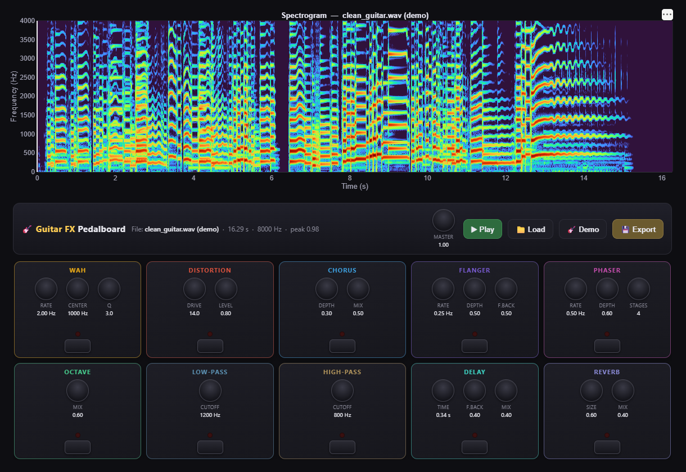
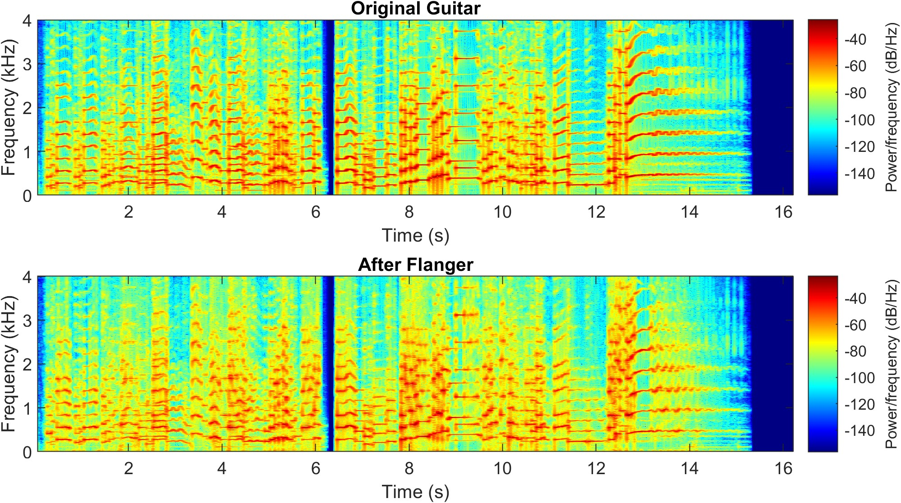
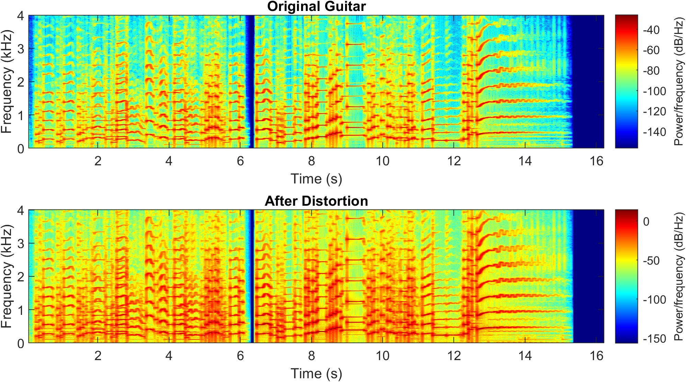

# 🎸 Digital Guitar Effects in MATLAB

This project demonstrates a set of digital guitar effects implemented in pure MATLAB.  
The code processes a clean guitar signal (from a solo by my band *Buluşalım Rüyalarda- Siyah Orkide*) and applies common effects such as:

- Delay
- Reverb
- Chorus / Octaver
- Flanger
- Phaser
- Distortion
- Low-Pass Filter
- High-Pass Filter
- Wah Pedal


Each effect is implemented from scratch using basic signal processing equations — no toolboxes, plugins, or external packages were used.

---

## 🎛️ Interactive Pedalboard App

An interactive app turns these effects into a playable pedalboard. Launch it in MATLAB (R2025a or newer):

```matlab
addpath('app')
guitarFXApp
```



The front end (`pedalboard.html`) is plain HTML/CSS/JS rendered inside a MATLAB `uihtml` component; MATLAB does the DSP and plays the audio. Turning a knob or tapping a footswitch sends the whole pedal configuration to MATLAB, which re-renders the chain and redraws the spectrogram.

### Controls

| Control | What it does |
|---|---|
| **Load** | Open your own `.wav` (stereo is summed to mono). |
| **Demo** | Load the bundled `clean_guitar.wav`. |
| **Play / Stop** | Audition the processed sound. The button turns red while playing. |
| **Export** | Render the current settings to a new `.wav`. What you hear is what gets written. |
| **Master** | Output gain, in the top bar. |
| **Knobs** | Drag up or down to set a value. Hold **Shift** for fine control; **double-click** to reset to default. |
| **Footswitch** | Tap the switch (the LED lights) to engage a pedal. |

### Keyboard and accessibility

Every knob and footswitch is keyboard-operable:

- **Tab** moves between knobs, footswitches, and buttons, with a focus ring on the active control.
- On a knob: **↑ / ↓** (or **← / →**) nudge by one step, **PageUp / PageDown** by ten steps, **Home / End** jump to min and max. Knobs expose their value to screen readers as ARIA sliders.
- On a footswitch: **Space** or **Enter** toggles the pedal.
- Motion respects `prefers-reduced-motion`.

### Signal chain

Pedals run in classic front-of-amp then FX-loop order:

> Wah → Distortion → Chorus → Flanger → Phaser → Octave → Low-Pass → High-Pass → Delay → Reverb → Master

Bypassed pedals are skipped, so only the engaged effects shape the sound. The live spectrogram redraws whenever a control changes, and a playhead sweeps across it during playback.

### Files

All app code lives in [`app/`](app):

- [`pedalboard.html`](app/pedalboard.html) — the UI (self-contained HTML/CSS/JS).
- [`gfxApplyChain.m`](app/gfxApplyChain.m) — the DSP: parametric versions of the `Guitar_FX.m` effects.
- [`guitarFXApp.m`](app/guitarFXApp.m) — the wiring between the UI and MATLAB.
- [`gfx_selftest.m`](app/gfx_selftest.m) — validates the effect chain headlessly, with no UI.

The demo clip `clean_guitar.wav` stays in the repo root, shared with `Guitar_FX.m`.

---

## 🧠 How It Works

All processing is done in a single script: [`Guitar_FX.m`](Guitar_FX.m)

Simply provide a mono `.wav` file (e.g., `guitar_clean.wav`) in the same directory and run the script in MATLAB.

Each effect block:
- Applies the DSP algorithm
- Outputs the result via `sound(...)`
- Generates plots and (optionally) spectrograms

---

## 🔍 Spectrogram Visualizations

Spectrograms showing the time–frequency behavior of each effect are included in `/spectrograms`.

<p float="left">
  
  
</p>

---

## 📄 Report

A technical mini-report is available in the [`report.pdf`](report.pdf) file.  
It includes:
- DSP equations  
- Observations from each spectrogram  
- A summary of methods used

---

## ⚖️ License

This project is licensed under the MIT License — free to use, modify, and cite. Attribution appreciated!

© 2025 Andac Y. Kaya
